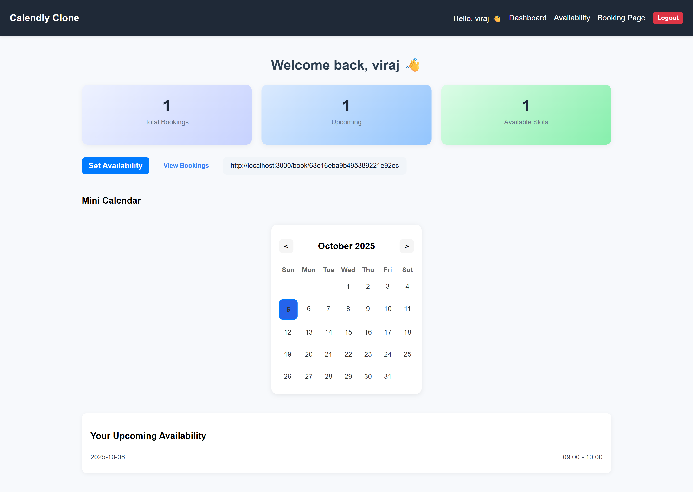
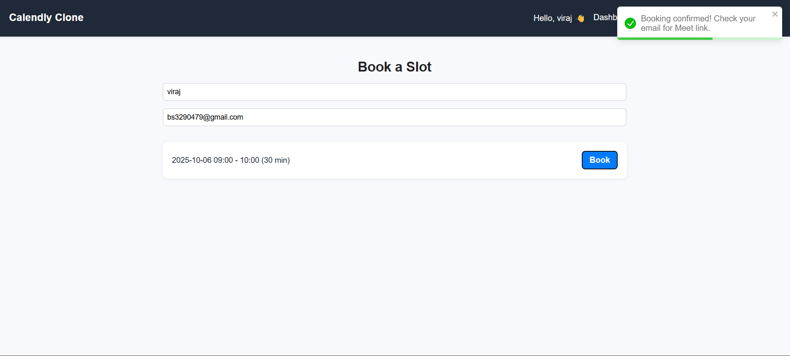

Perfect 👍 Here’s a **professional `README.md`** for your **Calendly Clone (Appointment Scheduling App)** project — structured for GitHub or Vercel deployment.

---

```markdown
# 🗓️ Calendly Clone – Appointment Scheduling Web App

A full-stack appointment scheduling system inspired by **Calendly**, built using the **MERN stack** (MongoDB, Express.js, React.js, Node.js).  
It allows users to set their availability, share booking links, and receive appointments automatically — eliminating the hassle of back-and-forth communication.

---

## 🚀 Features

### 🔐 User Authentication
- Register and log in securely.
- Each user gets a **unique booking link** (e.g., `/book/:userId`).

### 📅 Availability Management
- Define your weekly or specific-day availability.
- Slots can be dynamically added, updated, or deleted.

### 👥 Public Booking Page
- Visitors can view your available slots in real-time.
- They can enter their name and email to confirm a booking.
- Automatic email confirmation with meeting details and link.

### 🧭 Dashboard
- Displays total bookings, upcoming meetings, and available slots.
- Copy your booking link with one click.
- Integrated mini calendar and quick actions.

### 📧 Email Notifications
- Confirmation email sent to both host and visitor.
- (Optional) Integration with Gmail API for replies or cancellations.

---

## 🏗️ Tech Stack

| Layer | Technology |
|-------|-------------|
| Frontend | React.js (Hooks, Axios, Toastify, React Router) |
| Backend | Node.js + Express.js |
| Database | MongoDB with Mongoose |
| Date & Time | date-fns |
| Deployment | Vercel (Frontend) + Render/Atlas (Backend) |

---

## ⚙️ Folder Structure

```

calendly-clone/
│
├── server/                  # Backend (Node + Express)
│   ├── config/              # Database connection
│   ├── models/              # Mongoose models (User, Availability, Booking)
│   ├── routes/              # Express routes
│   ├── controllers/         # Route handlers
│   └── server.js            # Main entry point
│
└── client/                  # Frontend (React)
├── src/
│   ├── api/             # Axios instance
│   ├── components/      # Shared UI components
│   ├── pages/           # Dashboard, BookingPage, AvailabilityPage, etc.
│   ├── style/           # CSS files
│   └── App.js           # Routes setup

````

---

## ⚡ Installation & Setup

### 1️⃣ Clone Repository
```bash
git clone https://github.com/sandy1828/calendly-clone.git
cd calendly-clone
````

### 2️⃣ Install Dependencies

```bash
# Backend
cd server
npm install

# Frontend
cd ../client
npm install
```

### 3️⃣ Environment Variables

#### Server (.env)

```bash
MONGO_URI=your_mongodb_connection_string
PORT=5000
EMAIL_USER=your_email@gmail.com
EMAIL_PASS=your_app_password
CLIENT_URL=http://localhost:3000
```

#### Client (.env)

```bash
VITE_API_URL=http://localhost:5000/api
```

### 4️⃣ Run Locally

```bash
# Backend
cd server
npm run dev

# Frontend
cd ../client
npm start
```

Then open [http://localhost:3000](http://localhost:3000).

---

## 🧩 API Endpoints

| Method | Endpoint                     | Description                        |
| ------ | ---------------------------- | ---------------------------------- |
| `POST` | `/api/users/register`        | Register new user                  |
| `POST` | `/api/users/login`           | Login user                         |
| `GET`  | `/api/availability/me`       | Get current user's availability    |
| `POST` | `/api/availability/create`   | Create new slot                    |
| `GET`  | `/api/availability/user/:id` | Public availability of a user      |
| `POST` | `/api/bookings/create`       | Create a new booking               |
| `GET`  | `/api/bookings/my`           | Get all bookings of logged-in user |

---

## 📸 Screenshots

| Dashboard | Booking Page |
| ---------- | ------------- |
|  |  |

---

## 💡 Future Enhancements

* Google Calendar sync.
* Meet link auto-generation.
* Custom time zones and recurring slots.

---

## 🧑‍💻 Author

**Sandeep Sanotra**
MERN Stack Developer
📧 [[aspsandeep960@gmail.com](aspsandeep960@gmail.com)]
🌐 [Portfolio: https://portfolio-sandeep-plum.vercel.app/  / GitHub Link: https://github.com/sandy1828]

---

### ⭐ If you like this project, don't forget to star the repo!

```
